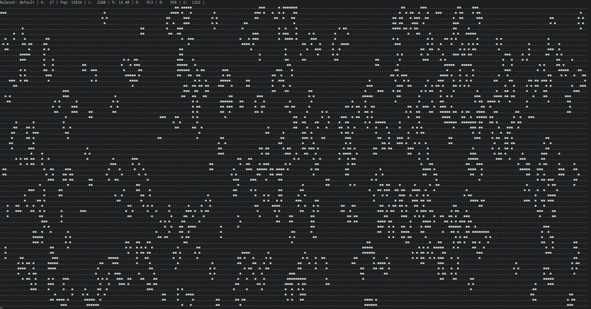
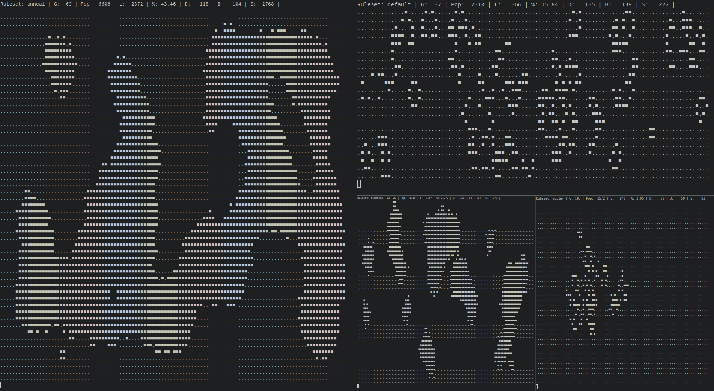
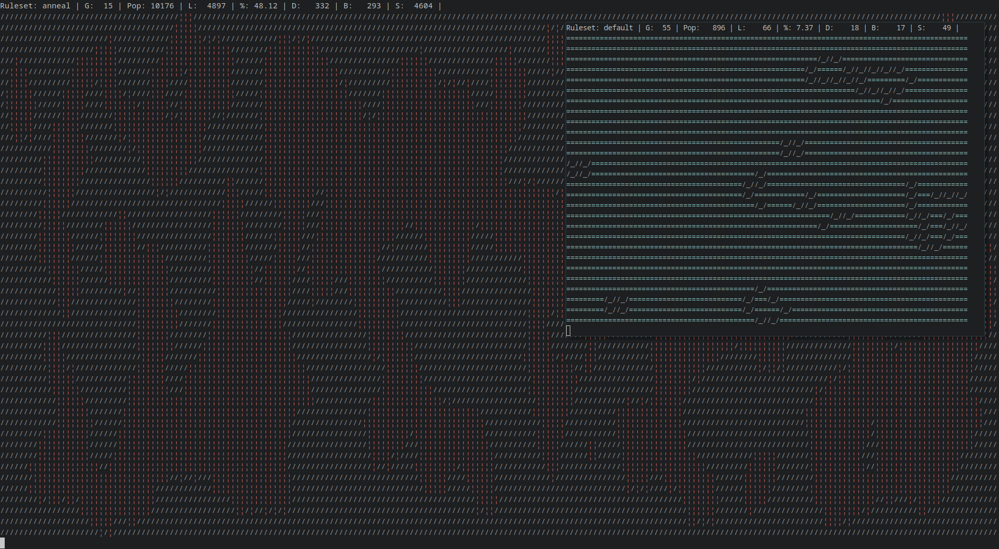
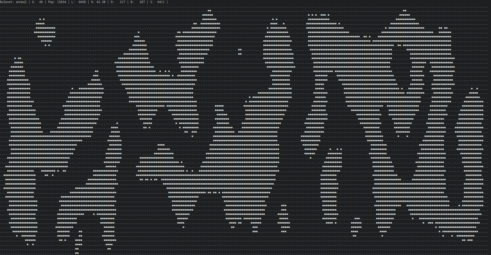

# pyGoL
CLI Game of Life to fill your terminal windows. written in python.



Now with colour and wide cell support!


ToC:
- [pyGoL](#pygol)
- [Installation](#installation)
  - [Windows](#windows)
  - [Linux](#linux)
- [Usage](#usage)
  - [Rulesets](#rulesets)
- [TODO](#todo)
- [Gallery](#gallery)


# Installation

Get the latest version of [python](https://www.python.org/).
For colour support, install [blessings](https://github.com/erikrose/blessings) with pip or your package manager.

Save `gol.py` or `gol_col.py` to your machine.

## Windows

You are done.

## Linux

Make the file executable:
```
chmod u+x gol.py
```

Optionally,
place it in your `bin` folder and remove the `.py` extension to cleanly run it anywhere:
```
sudo cp gol.py /usr/bin/gol
```

# Usage
double click it or run it from a terminal window.

When running from a terminal window, one may resize the window and the game will resize itself to fit the window upon resetting.

To stop the game from running, press `ctrl+c` or forcibly close the window.

```
  -rs RULESET, --rule-set RULESET
                        Defining game of life ruleset. Default: 'default'
                        (original b3s23 game)
  -g GENERATIONS, --generations GENERATIONS
                        Maximum number of generations before ending a game of
                        life. -1 for an infinite game. Default: 500
  -d DELAY, --delay DELAY
                        Number of seconds between iterations. Default: 0.1125
  -l LIVING, --living LIVING
                        character used to represent a living cell in the
                        simulation
  -de DEAD, --dead DEAD
                        character used to represent a dead cell in the
                        simulation
  -lc LIVING_COLOUR, --living-colour LIVING_COLOUR
                        color of character used to represent a living cell
  -dc DEAD_COLOUR, --dead-colour DEAD_COLOUR
                        color of character used to represent a dead cell
```

Colour support is only in `gol_col.py`. Black, red, gree, yellow, blue, magent, cyan, and white(default) are the available colours regardless of system.
One can also feed an integer value which will display a different colour depending on the system. Test using the `display_colours.py` file.

## Rulesets

Rulesets are defined by the conditions for a cell to be born or to survive. The original ruleset proposed by Conway consisted of birth when surrounded by 3 living cells and survival while surrounded by 2 or 3 living cells.

Effective shorthand: B3/S23

Below are the different rulesets that can be fed as arguments to the program using the `-rs` flag
|Ruleset name(s)|rules|description|
|:-|:-|:-|
|` ` `default`|B3/S23|classic|
|`replicator`|B1357/S1357|every pattern turns into a [replicator](https://conwaylife.com/wiki/Replicator)|
|`seeds`|B2/S|explodes under completely random grid, can be fed patterns that result in interesting and simple [spaceships](https://conwaylife.com/wiki/Spaceship)|
|`blank` `kuhaku`|B25/S4|I don't remember where I found this|
|`life-without-death` `LWD` `inkspots` `flakes`|B3/S123456789|very cool :)|
|`34` `34-life` `34L`|B34/S34|explosive with simple spaceships|
|`diamoeba`|B35678/S5678|makes big diamonds|
|`block` `2x2`|B36/S125|many simple [still lifes](https://conwaylife.com/wiki/Still_life), [oscillators](https://conwaylife.com/wiki/Oscillator), spaceships, and 2x2 blocks|
|`morley` `move`|B368/S245|lots of simple oscilators and stabilizes randomness very quickly|
|`majority` `vote`|B34678/S35678|stabilizes into blobs|
|`anneal` `twisted-majority-rule` `TMR`|B5678/S45678|modification of the previous, does not stabilize|

Different rulesets are defined in code underneath the `ruleCheck()` function using an elif ladder and primitive integer arrays.

The design is very human making it easy to edit and expand upon. There's a lot of [different rules for game of life](https://conwaylife.com/wiki/List_of_Life-like_rules) that you can choose to implement if you so choose.

I'm a big fan of `anneal` myself

so I chose to implement it myself.

# TODO
 - [x] enable editing of the dead and living cell characters from the command line
 - [x] colour output for linux
 - [ ] colour output for windows
 - [x] >1 char wide cells
 - [ ] Toggle stats display
 - [ ] Accept input from a file
 - [ ] Output final gamestate to files
 - [ ] Make forever looping optional
 - [ ] Implement more rulesets
 - [ ] detect a dead game with oscilators

# Gallery


